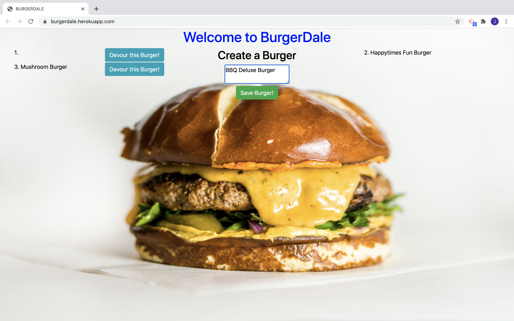

 # Project Title : BurgerDale
  ## Project Description:
  This web application allows the user to create a burger and set it to a list which can then later be devoured and moved to the done pile. Something like this could be used in a resturant kitchen to track orders.
 
  ## Table of Contents
  * [Installation](#installation)
  * [Usage](#usage)
  * [Contributing](#contributing)
  * [Test](#test)
  * [Questions](#questions)
  * [License](#license)
  * [Author](#Author)
  ## Installation
  This project is depolyed on Heroku at https://burgerdale.herokuapp.com/
  ## Usage
  Navigate to the website and use the input to crete a new burger. Hit the save button to add it to the list. When you are feeling hungry hit the Devour button and watch it move to the done pile.
  ## Contributors
  Donald Chromy, Douglas Mitchell
  ## Test
  N/A
  ## Questions
  If you have any questions, contact Bowerpower85 on GitHub or email at bowerpower85@gmail.com.
  ## License
  MIT License 
  Copyright (c) [year] [Bowerpower85]
  Permission is hereby granted, free of charge, to any person obtaining a copy
  of this software and associated documentation files (the "Software"), to deal
  in the Software without restriction, including without limitation the rights
  to use, copy, modify, merge, publish, distribute, sublicense, and/or sell
  copies of the Software, and to permit persons to whom the Software is
  furnished to do so, subject to the following conditions:
  The above copyright notice and this permission notice shall be included in all
  copies or substantial portions of the Software.
  THE SOFTWARE IS PROVIDED "AS IS", WITHOUT WARRANTY OF ANY KIND, EXPRESS OR
  IMPLIED, INCLUDING BUT NOT LIMITED TO THE WARRANTIES OF MERCHANTABILITY,
  FITNESS FOR A PARTICULAR PURPOSE AND NONINFRINGEMENT. IN NO EVENT SHALL THE
  AUTHORS OR COPYRIGHT HOLDERS BE LIABLE FOR ANY CLAIM, DAMAGES OR OTHER
  LIABILITY, WHETHER IN AN ACTION OF CONTRACT, TORT OR OTHERWISE, ARISING FROM,
  OUT OF OR IN CONNECTION WITH THE SOFTWARE OR THE USE OR OTHER DEALINGS IN THE
  SOFTWARE.
  ## Author
  

  